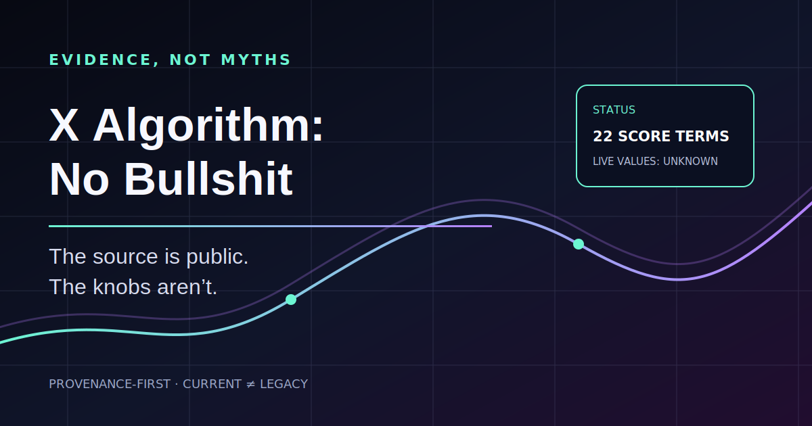
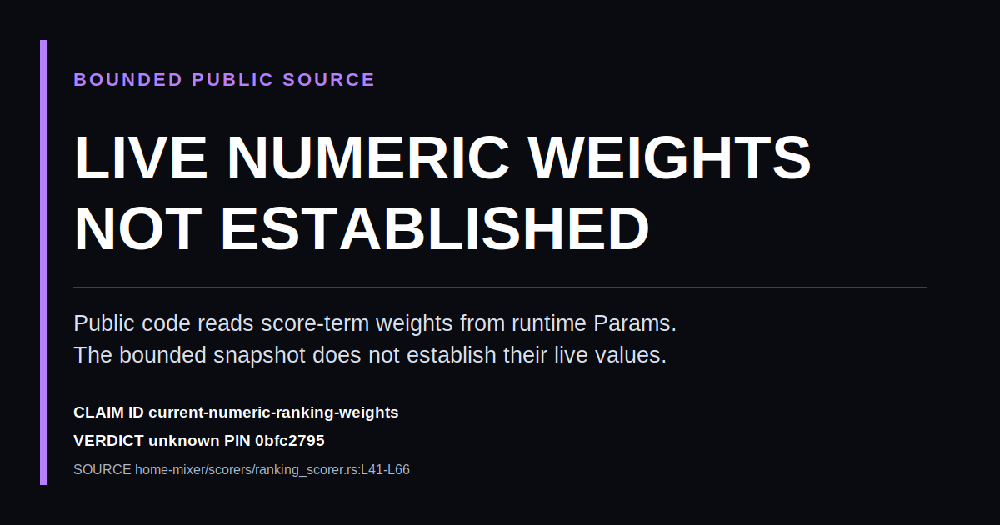
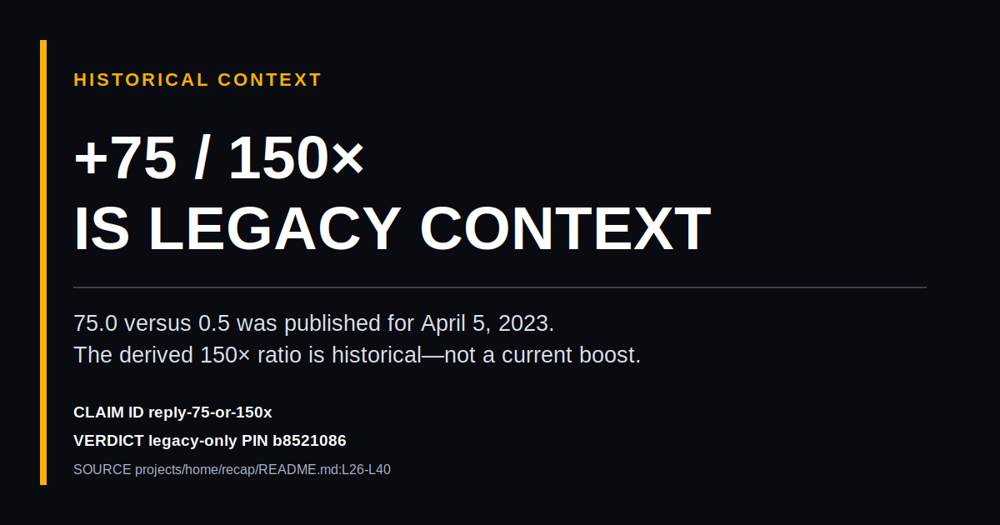
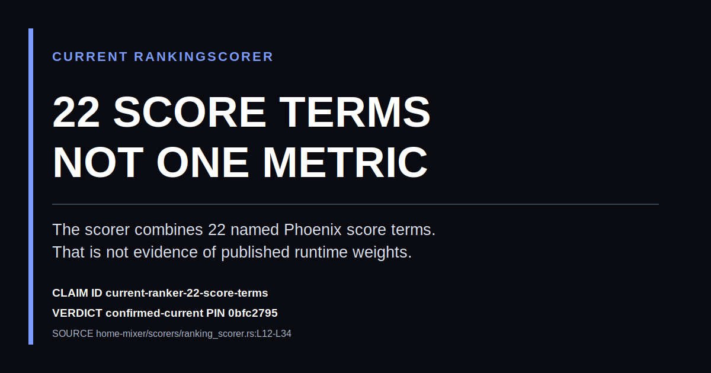

<p align="center">
  
</p>

<h1 align="center">X Algorithm: No Bullshit</h1>

<p align="center">
  <strong>소스는 공개됐다. 조정값은 공개되지 않았다.</strong><br>
  X의 2026년 5월 For You 공개본을 위한 근거 검증 레지스트리와 에이전트 스킬.
</p>

<p align="center">
  <a href="README.md">English</a> ·
  <a href="claims/claims.json">주장 레지스트리</a> ·
  <a href="skills/x-post-optimizer/SKILL.md">에이전트 스킬</a> ·
  <a href="docs/launch-kit.md">런치 키트</a>
</p>

---

흔히 보이는 “X 알고리즘 공략”에는 치명적인 문제가 하나 있다. **2023년 숫자 가중치**와 **2026년 Phoenix/Grok 구조**를 한 표에 섞은 다음, 전부 지금도 적용되는 사실처럼 말한다.

이 저장소는 그 혼합을 어렵게 만든다. 모든 주장에 commit이 고정된 출처와 판정 하나를 붙인다.

`confirmed-current` · `legacy-only` · `inferred` · `unsupported` · `unknown` · `contradicted`

출처 없는 성장론도, 가짜 0–100 바이럴 점수도, 공개 미니 모델을 실제 개인화 랭커처럼 포장하는 일도 없다.

## 60초 요약

| 주장 | 판정 | 근거 |
| --- | --- | --- |
| 현재 `RankingScorer`는 **22개의 명명된 Phoenix 점수 항목**을 결합한다. | `confirmed-current` | [`ranking_scorer.rs` L12–L34, L146–L170](https://github.com/xai-org/x-algorithm/blob/0bfc2795d308f90032544322747caacd535f75ae/home-mixer/scorers/ranking_scorer.rs#L12-L34) |
| 각 가중치는 런타임 feature-switch 파라미터에서 읽는다. | `confirmed-current` | [`ranking_scorer.rs` L41–L66](https://github.com/xai-org/x-algorithm/blob/0bfc2795d308f90032544322747caacd535f75ae/home-mixer/scorers/ranking_scorer.rs#L41-L66) |
| 공개 소스만으로 현재 숫자 가중치를 확정할 수 있다. | `unknown` | 제한된 공개본에는 런타임 조회만 있고 운영 값은 없다. |
| “작성자 답글 = 75이므로 지금도 좋아요의 150배다.” | `legacy-only` | [해당 표에는 2023년 4월 5일 값이라고 명시돼 있다](https://github.com/twitter/the-algorithm-ml/blob/b85210863f7a94efded0ef5c5ccf4ff42767876c/projects/home/recap/README.md#L26-L40). |
| 공개 체크포인트가 프로덕션 모델이다. | `contradicted` | [Phoenix 문서는 동결된 미니 모델이며 프로덕션은 더 크고 계속 학습된다고 밝힌다](https://github.com/xai-org/x-algorithm/blob/0bfc2795d308f90032544322747caacd535f75ae/phoenix/README.md#L27-L31). |
| 공개 문서끼리 미니 모델 사양이 일치한다. | `contradicted` | [최상위: 256차원/2층](https://github.com/xai-org/x-algorithm/blob/0bfc2795d308f90032544322747caacd535f75ae/README.md#L26-L32), [Phoenix: 128차원/4층](https://github.com/xai-org/x-algorithm/blob/0bfc2795d308f90032544322747caacd535f75ae/phoenix/README.md#L27-L31). |

전체 19개 항목은 [`claims/claims.json`](claims/claims.json)에 들어 있으며, [`주장 인덱스`](claims/README.md)에서 바로 훑어볼 수 있다.
## 공유 가능한 근거 카드

카드는 손으로 관리하는 캡처가 아니라 레지스트리에서 생성된다.

<p align="center">
  
  
  
</p>

`python scripts/generate_cards.py`로 동일하게 다시 만들 수 있다.

## 근거 감사 CLI

```bash
git clone https://github.com/berkshirehathaways/x-algorithm-no-bullshit.git
cd x-algorithm-no-bullshit
python -m pip install --no-deps -e .

xnb validate
xnb claims reply
xnb show current-numeric-ranking-weights
xnb audit "외부 링크를 넣으면 무조건 노출이 죽는다: https://example.com" --has-image
```

`xnb audit`은 의도적으로 **바이럴 점수를 출력하지 않는다.** 글 하나만으로는 운영 가중치, 독자별 맥락, 프로덕션 체크포인트, 후보 게시물, 진행 중인 실험을 알 수 없기 때문이다. 대신 무엇이 현재 근거인지, 과거 자료인지, 아직 가설인지 보여준다.

## 에이전트에게 워크플로 제공하기

기준 스킬은 [`skills/x-post-optimizer/SKILL.md`](skills/x-post-optimizer/SKILL.md)다. 이 스킬을 사용한 에이전트는:

1. 모든 사실 주장을 claim ID에 연결하고,
2. 현재·과거·추론·미확인 경계를 보존하며,
3. 서로 실질적으로 다른 훅을 최소 세 개 만들고,
4. 존재하지 않는 알고리즘 보너스를 지어내지 않으며,
5. 차단·뮤트·신고 같은 부정 반응 위험을 검토하고,
6. 게시물 후보와 측정 가능한 배포 실험을 함께 반환한다.

Agent Skills 호환 프로젝트에 복사:

```bash
mkdir -p .agents/skills
cp -R skills/x-post-optimizer .agents/skills/
```

Claude Code 플러그인 설치:

```text
/plugin marketplace add berkshirehathaways/x-algorithm-no-bullshit
/plugin install x-algorithm-no-bullshit@x-algorithm-no-bullshit
```

요청 예시:

```text
x-post-optimizer를 사용해라.
대상: 75/0.5 표가 현재 값이라고 믿는 ML 엔지니어.
목적: 누구나 원문에서 검증할 수 있는 강한 반박문 작성.
제약: claim ID를 붙이고 노출 예측이나 분노 유도는 하지 말 것.
```

도구 연동은 [`docs/agent-contract.md`](docs/agent-contract.md)의 안정된 JSON 입출력 계약을 사용할 수 있다.

## 공개본으로 알 수 있는 것

- Thunder의 인네트워크 후보와 Phoenix의 아웃오브네트워크 후보 경로
- 현재 랭킹 스코어러가 결합하는 22개 값
- 관심 없음, 차단, 뮤트, 신고, 비체류 등 부정 행동 항목
- 작성자 다양성 감쇠와 설정 가능한 OON 가중
- 후보끼리 서로 보지 못하게 하는 attention mask
- 이미 본 게시물과 세션에서 이미 제공한 게시물을 제거하는 필터
- 공개 banger screen의 `quality_score >= 0.4` 양성 기준

## 공개본만으로 알 수 없는 것

- 현재 프로덕션 숫자 가중치
- 임의의 글에 대한 결정론적 점수
- banger 품질 점수의 숨겨진 정성 평가 rubric
- 프로덕션 모델, 실시간 사용자 맥락, 학습 스트림, A/B 실험
- 도달·반응·바이럴·피드 노출 보장

Phoenix는 실행 가능한 파이프라인으로 문서화돼 있다. 반면 완전한 Grox/Rust 프로덕션 경로를 독립적으로 재현할 수 있는지는 제한된 공개본으로 확정할 수 없다.

## 오래된 근거는 자동으로 걸린다

레지스트리는 upstream commit [`0bfc279`](https://github.com/xai-org/x-algorithm/tree/0bfc2795d308f90032544322747caacd535f75ae)에 고정돼 있다. 예약된 GitHub Action이 다음 명령으로 upstream 변화를 확인한다.

```bash
python scripts/check_upstream.py
python scripts/verify_sources.py
```

upstream이 바뀌면 예전·현재 SHA를 표시하고, 고정된 인용 URL과 라인 범위가 실제로 열리는지도 확인한다. 스크린샷이 조용히 “최신 사실”로 굳는 것을 막기 위해서다.

## 저장소 구성

```text
claims/                         기계 판독 주장·스키마·인덱스
contracts/                      에이전트 JSON Schema와 예시
skills/x-post-optimizer/        벤더 독립 에이전트 워크플로
src/xnb/                        외부 의존성 없는 근거 CLI
docs/agent-contract.md          버전이 있는 도구 연동 계약
docs/launch-kit.md              X·HN·Reddit·Product Hunt 런치 문구
scripts/check_upstream.py       upstream 변경 감지기
scripts/generate_cards.py       근거 카드 생성기
assets/cards/                   공유 가능한 근거 카드
assets/hero.svg                 저장소 히어로 아트워크
```

이 프로젝트는 X, xAI, Twitter와 관계없는 독립 프로젝트다. 실제 랭커를 재현하지 않는다. 잘못된 근거를 발견했다면 commit이 고정된 1차 출처와 바뀌어야 할 판정을 함께 제안해 달라.

**다음번에 2023년 캡처가 2026년 비밀처럼 팔릴 때 근거를 바로 찾을 수 있도록 Star해 두자.**

## 1차 출처

- 현재 공개본: [`xai-org/x-algorithm@0bfc279`](https://github.com/xai-org/x-algorithm/tree/0bfc2795d308f90032544322747caacd535f75ae)
- 과거 서비스 소스: [`twitter/the-algorithm`](https://github.com/twitter/the-algorithm)
- 과거 Heavy Ranker 가중치: [`twitter/the-algorithm-ml`](https://github.com/twitter/the-algorithm-ml)
